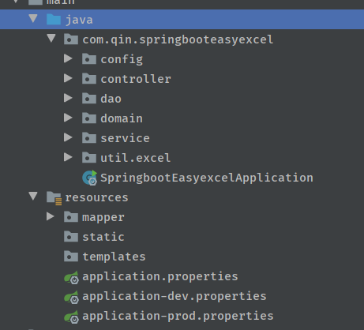
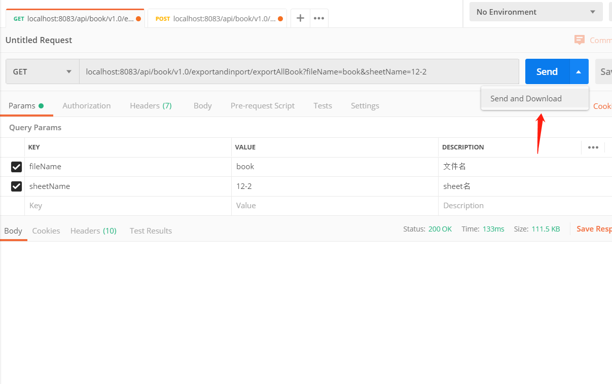

# springboot-easyexcel

### 基于springboot 与 easyexcel的导入导出 动态表头 控制层 业务层 数据层 

### 三层结构

### 导出postman操作

### 导出结果

### 导入postman操作及其结果

### 动态表头

### 横向导出

### 复杂对象

这个暂时无法用easyexcel做到 会出现上下覆盖的问题 具体看这个[issue](https://github.com/alibaba/easyexcel/issues/800)

这个是用easypoi实现的

代码请移步[这里](https://github.com/Qinxianshen/springboot-easypoi)

